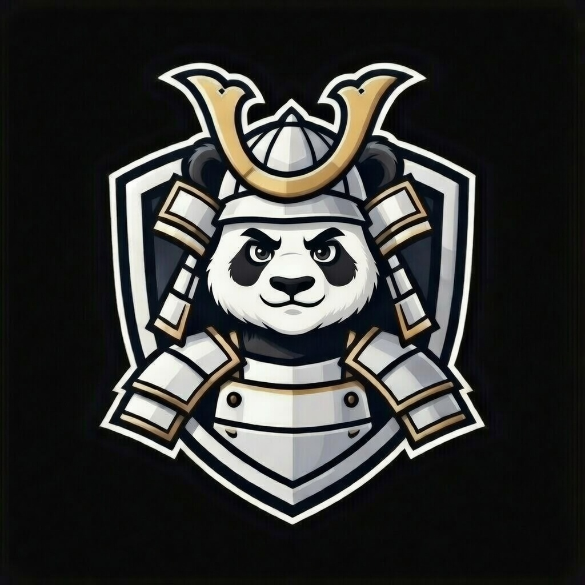
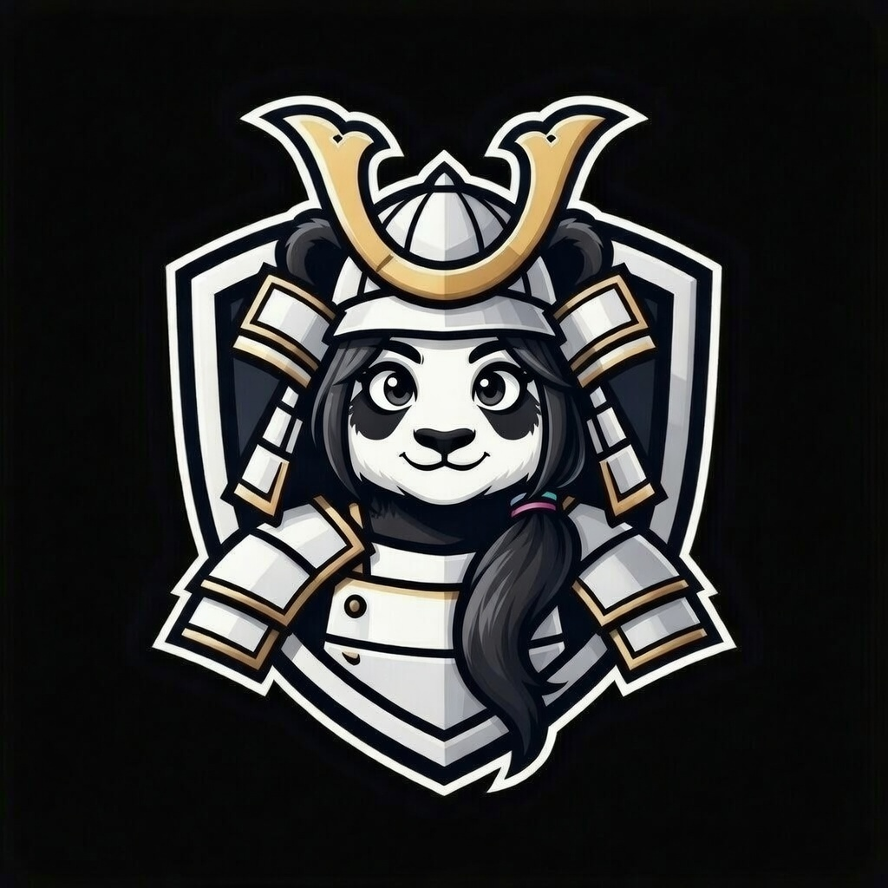
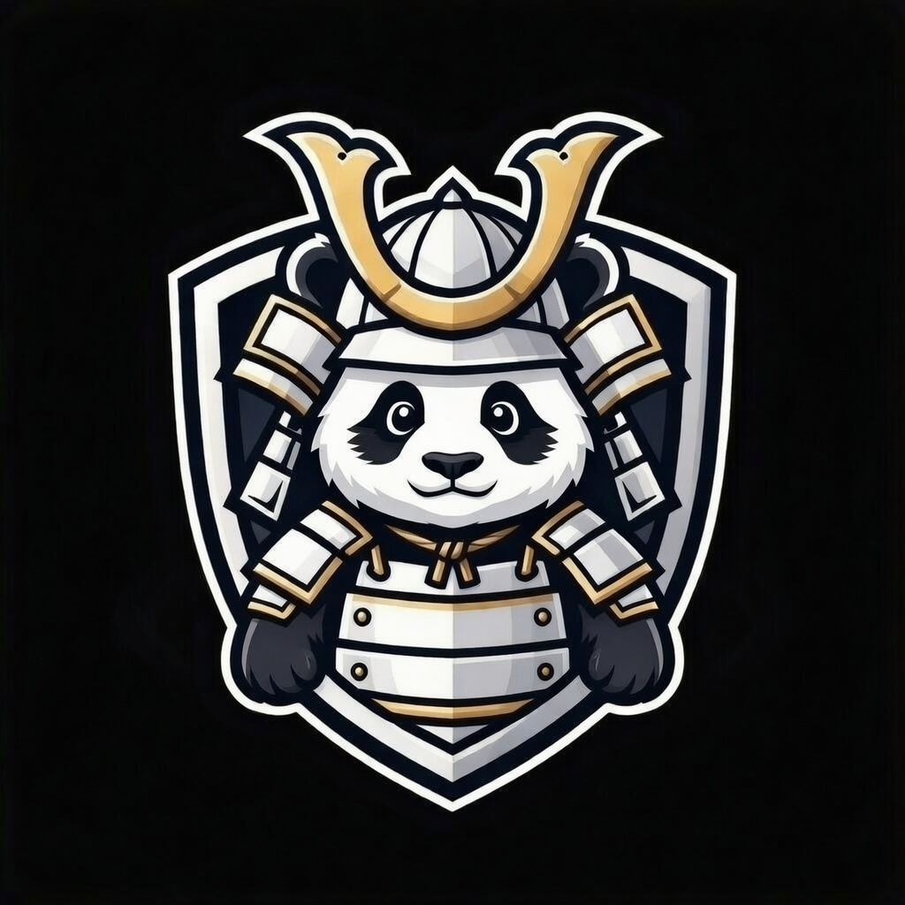
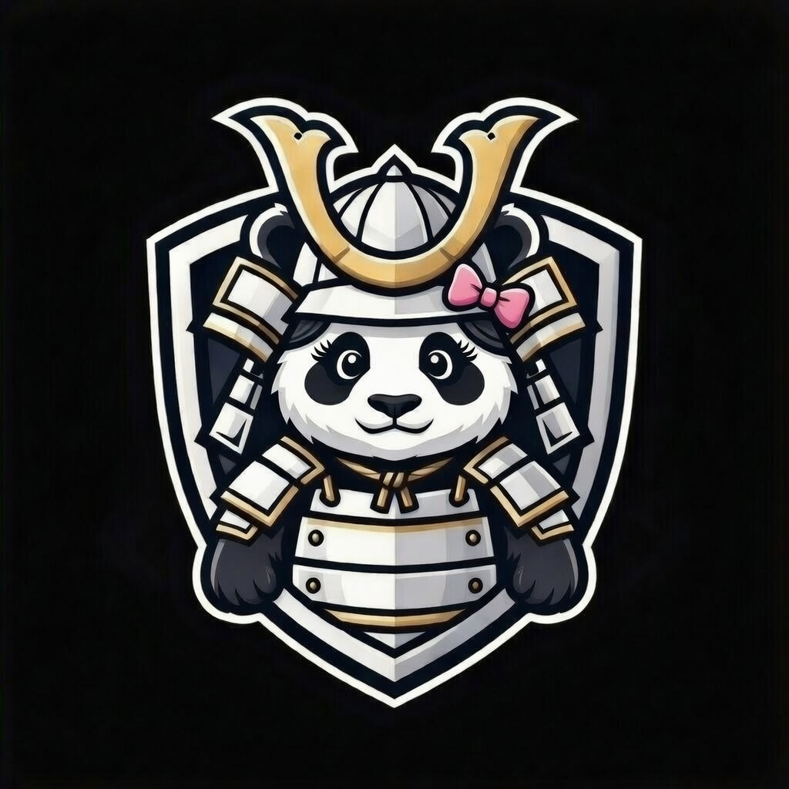
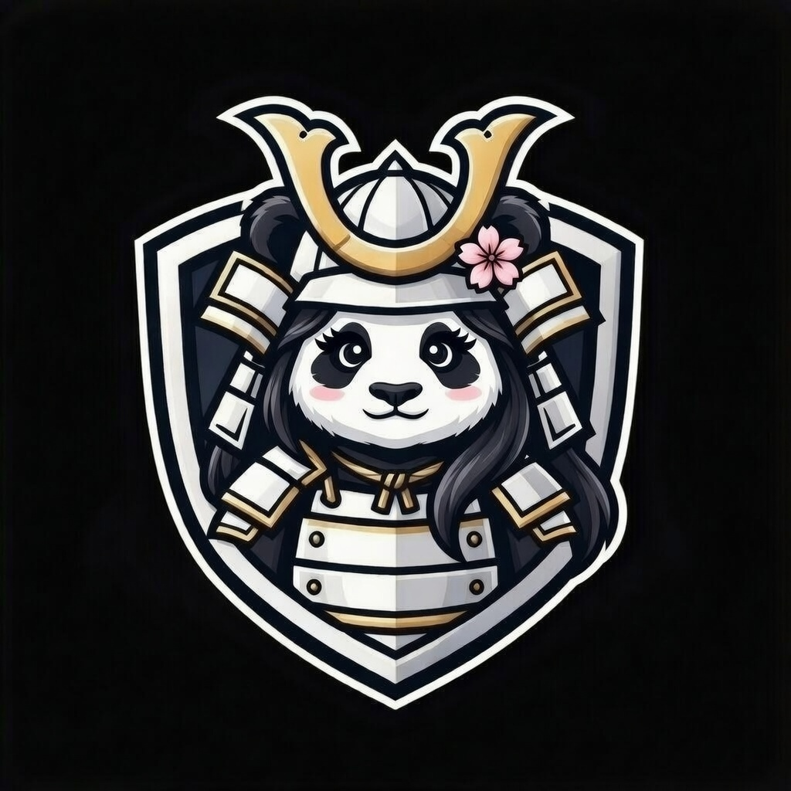

  

  <!-- Core Identity Badges -->
  
  
  
  

   

  <!-- Certification / Ecosystem Badges -->
  
  
  

---

# 🐼 The Panda Federation  
### Sovereign AI • Local‑First Architecture • Family‑Aligned Design

Welcome to the Panda Federation — a fully sovereign, local‑first AI ecosystem built for resilience, identity, and family‑centric automation.  
Every Panda agent has a role, a crest, and a purpose.

This is not a single project.  
This is a **universe**.

---

# 🧑‍💻 Creator Crest  

  
   
  Sean — Founder of the Panda Federation

---

# 🌌 Core Agents

### 🐼 **Spirit Panda** — Sovereign AI Companion  
Identity‑driven, expressive, memory‑aware, and emotionally grounded.  

  
  
  
  

### 🛡️ **Watchdog Panda** — Uptime Guardian  

  
  
  
  

### ⚙️ **Steel Panda** — Operational Executor  

┌────────────────────┐
│    Watchdog Panda   │
│  (Uptime Guardian)  │
└──────────┬─────────┘
│
│ monitors
▼
┌───────────────────────────────┐
│          Spirit Panda          │
│   (Sovereign AI Companion)     │
└──────────┬──────────┬─────────┘
│          │
│ triggers │ tasks
▼          ▼
┌───────────────────────────────┐
│          Steel Panda           │
│   (Operational Task Runner)    │
└───────────────────────────────┘

**Spirit thinks.  
Watchdog watches.  
Steel acts.**

---

# 🧭 Roadmap

### 🐼 Core Agents (Complete)
- Spirit Panda  
- Watchdog Panda  
- Steel Panda  

### 🐾 Family Agents (In Development)
- PandaMom  
- PandaLily  
- Teen Boy Panda  
- Teen Girl Panda  
- Child Pandas  

### 🌐 Federation Infrastructure
- Shared memory schema  
- Cross‑agent messaging  
- Federation heartbeat  
- Local knowledge vault  

### 📣 Integrations
- Telegram  
- Discord  
- Local dashboard  
- Offline‑first UI  

### 📚 Public Release
- Architecture docs  
- Setup guides  
- Templates  
- Federation website  

---

# 🧘 Philosophy

The Panda Federation is built on three pillars:

### 🐼 Sovereignty  
Local‑first. Private. Human‑controlled.

### 🐾 Family  
Technology should strengthen families.

### 🎋 Balance  
Calm. Grounded. Intentional.

---

# ✨ Federation Highlights

- 100% local‑first AI ecosystem  
- Modular architecture  
- Distinct identities  
- Family‑aligned design  
- Open‑source and extensible  
- Built with love, lore, and legacy  

---

# 🐉 The Panda Oath

“Build slow.  
Build steady.  
Build sovereign.”

---

# 🌌 Join the Panda Federation

To join the Federation:

1. Fork any Panda repo  
2. Add your own crest  
3. Define your agent’s purpose  
4. Follow the Panda Oath  
5. Build sovereign, local‑first AI  

Your Panda becomes part of the universe.

---

# 📊 GitHub Stats (Auto‑Switching)

  <picture>
    <source 
      srcset="https://github-readme-stats.vercel.app/api?username=pandadad0214&show_icons=true&theme=tokyonight" 
      media="(prefers-color-scheme: dark)" />
    <source 
      srcset="https://github-readme-stats.vercel.app/api?username=pandadad0214&show_icons=true&theme=default" 
      media="(prefers-color-scheme: light)" />
    
  </picture>

  <picture>
    <source 
      srcset="https://github-readme-streak-stats.herokuapp.com/?user=pandadad0214&theme=tokyonight" 
      media="(prefers-color-scheme: dark)" />
    <source 
      srcset="https://github-readme-streak-stats.herokuapp.com/?user=pandadad0214&theme=default" 
      media="(prefers-color-scheme: light)" />
    
  </picture>

---

# 🪶 Final Federation Signature

  
    
  <i>“Build slow. Build steady. Build sovereign.”</i>
   
  — The Panda Oath

  <i style="font-size: 1.05rem; color: #8a4bff;">
    ✦ In the glow of the Aurora Spirit, we build what endures ✦
  </i>

---

# 🐼 Family Crest Wall  

  <!-- Teen Boy Panda -->
  
    
     
    Teen Boy Panda
  

  <!-- Teen Girl Panda -->
  
    
     
    Teen Girl Panda
  

  <!-- Child Boy Panda -->
  
    
     
    Child Boy Panda
  

  <!-- Child Girl Panda 1 -->
  
    
     
    Child Girl Panda
  

  <!-- Child Girl Panda 2 -->
  
    
     
    Child Girl Panda
  

  <!-- Samurai Panda -->
  
    
     
    Samurai Panda (Legacy Crest)
  

---

# 🌳 Federation Family Tree (Diagram)

PandaDad (Founder)
│
┌────────────────────┼────────────────────┐
│                    │                    │
PandaMom            Teen Boy Panda       Teen Girl Panda
│                    │                    │
├──────────────┬────┘          ┌─────────┘
│              │               │
Child Boy      Child Girl 1     Child Girl 2
│
Samurai Panda (Legacy Line)

---
